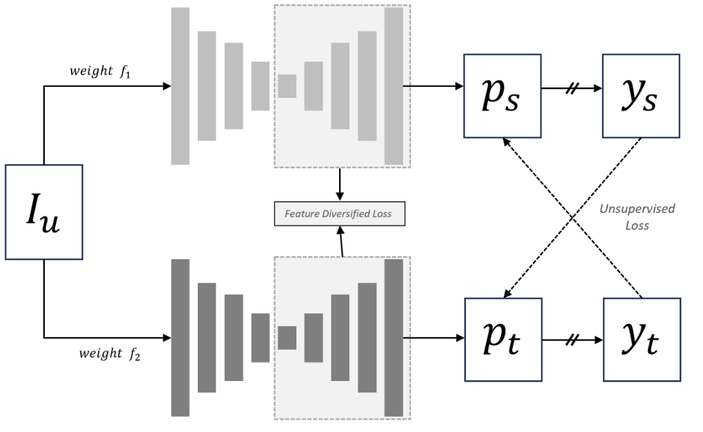

# Semi-Supervised Histopathology Image Segmentation with Feature Diversified Collaborative Learning




## Overview

We present **Feature Diversified Collaborative Learning (FDCL)**, a straightforward yet powerful method for semi- supervised histopathology image segmentation. FDCL enhances the power of collaborative training by eliminating a common challenge of this framework—confirmation bias. The core of FDCL is to encourage diverse feature learning across sub-networks, thereby guiding the model to produce robust confidence maps and enhancing the overall consis- tency of predictions.

## Datasets

1. **Download the datasets**:

   - GlaS dataset: [Download GlaS dataset](https://datasets.activeloop.ai/docs/ml/datasets/glas-dataset/)
   - CRAG dataset: [Download CRAG dataset](https://opendatalab.com/OpenDataLab/CRAG/tree/main)

2. **Format the dataset as follows**:
```bash
  dataset/
  ├── GlaS
  │    ├── train_sup_85
  │    │    ├── image
  │    │    │    ├── 1.tif
  │    │    │    ├── 2.tif
  │    │    │    └── ...
  │    │    └── mask
  │    │         ├── 1.png
  │    │         ├── 2.png
  │    │         └── ...
  ├── CRAG
  │    ├── train_sup_35
  │    │    ├── image
  │    │    └── mask
  │    ├── train_unsup_138
  │    │    ├── image
  │    │    └── mask
  │    └── val
  │         ├── image
  │         └── mask
```
## Training FDCL

1. **Install dependencies**:

Install the required Python libraries by running the following command:

```bash
pip install -r requirements.txt
```

2. Train the model:

Once the dataset is organized and the dependencies are installed, you can start training by running:

```bash
python main.py
```

## Citation

If you use this work in your research or project, please cite the following paper:

```bash
```


